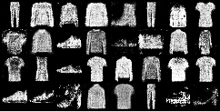
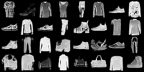
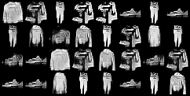
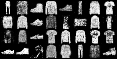
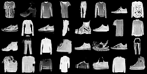
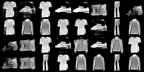

# Fashion-MNIST DCGAN  
**From MLP GAN to DCGAN — Understanding Spatial Inductive Bias in Image Generation**

This project explores how **architectural choices** in GANs affect image generation quality.  
We progressively move from a vanilla MLP-based GAN to a **DCGAN**, isolating the impact of convolutional inductive bias on both the Generator and the Discriminator.

The experiments are conducted on the **Fashion-MNIST** dataset.

---

## 🧠 Architectures Compared

1. **MLP Generator + MLP Discriminator**  
2. **MLP Generator + CNN Discriminator**  
3. **DCGAN (CNN Generator + CNN Discriminator)**  

All models are trained under the same settings to ensure a fair comparison.

---

## 📊 Visual Results

Below are **curated sample comparisons** across training epochs.  
Each row compares **MLP GAN vs DCGAN** outputs side by side.

### Epoch 30

| MLP GAN | DCGAN | DCGAN (Half Grid) |
|-------|-------|------------------|
|  |  |  |

---

### Epoch 45

| MLP GAN | DCGAN | DCGAN (Half Grid) |
|-------|-------|------------------|
|  |  |  |

---

## 🔍 Key Observations

- **MLP GAN** struggles to capture spatial structure, producing blurry and distorted samples.
- **CNN Discriminator alone** improves feedback but is not sufficient for high-quality generation.
- **DCGAN (CNN G + CNN D)** produces:
  - sharper edges  
  - clearer silhouettes  
  - more stable and diverse samples  

This confirms that **a CNN Generator is required to effectively utilize the structured gradients produced by a CNN Discriminator**.

---

## 🏗️ Model Highlights

### Generator (DCGAN)
- Linear projection → reshape to feature maps
- ConvTranspose2d layers for upsampling
- ReLU activations + BatchNorm
- Tanh output for normalized image range

### Discriminator
- Conv2d layers with progressive downsampling
- LeakyReLU activations
- BatchNorm in intermediate layers
- Sigmoid output (vanilla GAN loss)

---

## 📁 Notes

- Training outputs and datasets are excluded via `.gitignore`
- Only **curated example images** are included for clarity
- This repository focuses on **architectural understanding**, not hyperparameter tuning

---

## 🚀 Future Work

- WGAN / WGAN-GP for improved stability
- Conditional DCGAN (class-controlled generation)
- Higher-resolution datasets

---

## 📌 Takeaway

> **DCGAN works not because it is deeper, but because both Generator and Discriminator operate in the same spatial feature space.**

